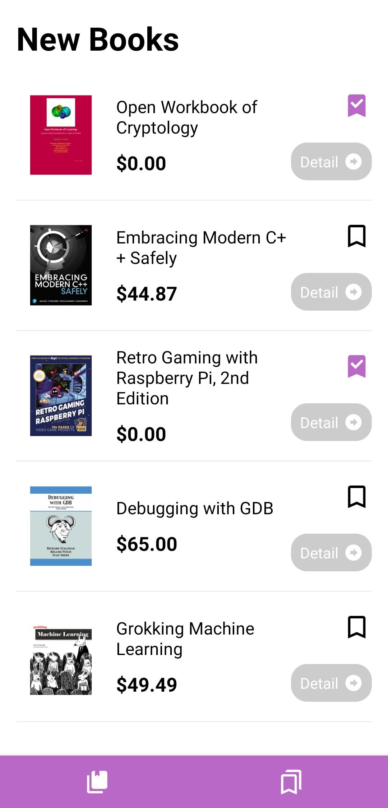
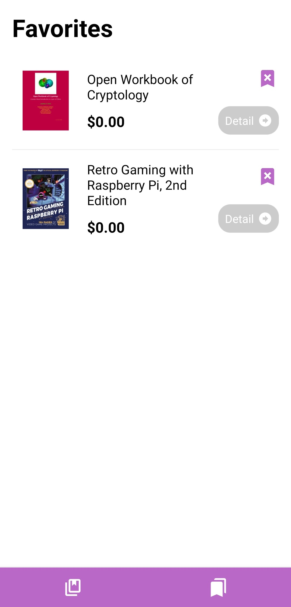

# Book Store App
This bookstore application is an application that shows newly released software and computer books. The user can add the books he likes to his favourites. If he wants, he can view the book details and reach the website where the book is sold and make a purchase.

## Used technologies
- React Native
- Redux
- React Native Navigation
- React Native Vector Icons
- Axios

## Installation
1.Clone Project
```
git clone https://github.com/furkanbagirgan/Bookstore-App.git
```
2.Install the Necessary Packages for Project
```
npm install
```
3.Run Project To Emulator or Real Device
```
npx react-native start & npx react-native run-android
```

## Screen Recording


## Screens
<kbd></kbd>
